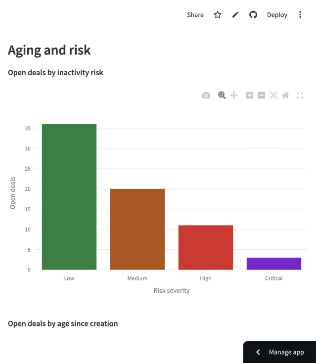

# Revenue Risk & Deal Bottleneck Analyzer

A portfolio application that helps teams turn their own sales-pipeline spreadsheets into useful analysis of stalled deals and operational delays.

Upload or choose a sample, match columns, and check the entire file before exploring pipeline KPIs, deal aging, inactivity risk, and bottlenecks. Interactive filters, configurable stalled thresholds, evidence-based suggestions, and downloadable analyses make every result reviewable. An optional DuckDB/SQL check independently recomputes selected results.

## Open the app online

[Open Revenue Risk Analyzer](https://anaanya-revenue-risk-analyzer.streamlit.app/)

The app is hosted on Streamlit Community Cloud. Bookmark this link; you do not need Terminal or a running laptop to use it. Choose **Try sample data**, then **Check data** to explore the current build.

The code and version history are saved in [the GitHub repository](https://github.com/anaanya13/revenue-risk-analyzer). Request future changes in the project task; publishing changes to GitHub updates the hosted app.

## Run locally (optional)

Open Terminal and run:

```bash
cd ~/Desktop/revenue-risk-analyzer
bash scripts/start.sh
```

Keep Terminal open while using the app. If your browser does not open automatically, visit [http://localhost:8501](http://localhost:8501). To stop, return to Terminal and press **Control + C**.

For a guided first visit and troubleshooting, read [START_HERE.md](START_HERE.md).

## Midnight & Teal interface

A navy gradient backdrop, readable white KPI cards, coordinated charts and priority badges organize the analysis into **Data setup**, **Dashboard**, **Action plan** and **Verification** tabs. Shared controls live in the sidebar. After checking a sample or upload, open Dashboard to see the results. The visual refresh does not change the business rules.

## What works in version 1.0

- Upload a CSV or Excel `.xlsx` file; choose the worksheet for Excel files.
- Try the original sample, a deliberately messy test file, or a file with different column names.
- Review the file and match its columns to the app's standard fields.
- Choose how dates should be interpreted and the date used for validation.
- Run data checks and review issues by row. Download the issue report, then download cleaned data once every row passes.

- View pipeline and outcome KPIs, aging charts, Low/Medium/High/Critical inactivity categories, and revenue at risk.
- Adjust the stalled threshold (default 30 days), apply dashboard filters, and review stage, representative, and recorded-delay summaries.
- Download filtered deal analysis with calculation settings, or the stage summary.
- Read suggested next steps and download an action plan with supporting deal IDs.
- Run an independent SQL calculation check and download the comparison report.

The checker keeps every row. It does not silently remove invalid or duplicate records to make a file pass.

The app supports compatible sales-pipeline data. Column mapping helps it understand different headers; it does not make every arbitrary spreadsheet suitable for analysis.

## Data the app needs

Required: **Deal ID, Deal Value, Created Date, Last Activity Date, Current Stage, Status**.

Optional: **Delay Reason, Follow Ups, Sales Representative, Lead Source, Industry, Product**.

Read the [data dictionary](docs/data_dictionary.md) for meanings and examples. The original synthetic workbook contains 120 deals, 14 columns, and two worksheets: `Deals` and `Data Dictionary`.

## Where things are saved

| Item | Purpose |
| --- | --- |
| `app.py` | The application you run |
| `src/` | Reusable data-processing, analytics and recommendation code |
| `sql/` | Saved independent age/risk, KPI and stage-summary queries |
| `docs/SQL_ANALYSIS.md` | How the independent calculation check works |
| `scripts/start.sh` | Starts the application using this project's Python environment |
| `scripts/check.sh` | Runs the project checks |
| `requirements.txt` | Records the Python packages needed by the project |
| `data/sample/revenue_risk_sample_data.xlsx` | Original synthetic workbook |
| `data/test/` | Deliberately messy data and alternate column names for testing |
| `docs/project_specification.md` | Product scope, definitions, and planned stages |
| `docs/PROGRESS.md` | Work record and next milestone |
| `docs/project_brief.pdf` | Historical brief for the earlier Excel/Power BI concept |
| `docs/archive/` | Original application and handoff text, kept locally and excluded from GitHub |
| `.venv/` | Local Python environment; do not edit its files |

The historical brief is background material. The [current specification](docs/project_specification.md) describes the automated application being built now.

## Check the project

From the project folder:

```bash
bash scripts/check.sh
```

The verification record is in [PROGRESS.md](docs/PROGRESS.md).

## Portfolio package and handover

**Portfolio version 1.0 is complete and deployed.** The project has 71 passing automated tests; GitHub checks passed on Python 3.9 and 3.12. The hosted sample produced 555 agreeing Python/SQL comparisons. See the [release record](docs/RELEASE_CHECKLIST.md).

- [Your remaining personal steps](docs/PROJECT_HANDOVER.md): no coding or Terminal needed.
- [Five-minute demo](docs/DEMO_WALKTHROUGH.md).
- [Case study and resume wording](docs/PORTFOLIO_CASE_STUDY.md).
- [Interview notes](docs/INTERVIEW_NOTES.md).
- [Screenshot gallery](docs/screenshots/README.md).



Close-date trends, time-in-stage analysis, accounts and saved analysis history are optional extensions requiring additional data or requirements. They are outside this release. This hosted portfolio project has not been evaluated with a live company's workflow. A flagged deal represents pipeline exposure under a stated rule, not a prediction that its value will be lost.
