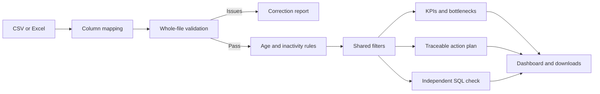

# Revenue Risk & Deal Bottleneck Analyzer

**A deployed sales-pipeline analysis portfolio project**

[Live application](https://anaanya-revenue-risk-analyzer.streamlit.app/) · [GitHub repository](https://github.com/anaanya13/revenue-risk-analyzer)

## Business problem

A sales-pipeline spreadsheet can contain valuable opportunities without making it obvious which ones have gone inactive. Different file formats and incomplete fields make comparisons harder. The project addresses a practical review question: which Open deals need attention, and how much pipeline value is associated with those deals?

## Solution

The application lets a user upload a CSV or Excel file, map its columns, resolve data-quality issues, and explore a consistent dashboard. It separates deal age from inactivity, applies a configurable stalled threshold, and summarizes exposure by stage. Optional owner, delay and follow-up fields add context. Suggested next steps include counts, values and supporting deal IDs so the user can trace each suggestion to the selected records.

The app checks the entire file before showing analytics. It does not silently discard difficult rows or fabricate missing optional details. Its exports capture the settings needed to understand the results later.

## Demonstration findings

The original synthetic sample contains 120 deals. At analysis date September 22, 2026, with a 30-day stalled threshold and all filters selected:

| Result | Value |
| --- | --- |
| Open / Won / Lost deals | 70 / 27 / 23 |
| Open pipeline value | 3,102,500 |
| Won deal value | 1,046,000 |
| Win rate | 54% |
| Stalled Open deals | 14 |
| Revenue at risk | 647,000, or about 20.9% of Open value |
| Critical opportunities | 3 deals, worth 138,000 |
| Stage with highest stalled value | Documentation: 5 stalled deals, worth 180,000 |

Amounts use the sample's single currency; no currency conversion is applied. These are synthetic demonstration findings, not evidence of commercial loss, recovered revenue or productivity gains.

## How it works

Python and pandas handle loading, cleaning and analysis. Streamlit provides the interface, Plotly the charts, openpyxl the Excel support, and DuckDB the independent SQL calculations. Saved queries recompute age/risk from selected base dates, then compare all 15 KPIs, stage summaries and each selected deal's assessment with Python.

## Important design decisions

- **Open deals only for current exposure:** closed records still contribute to outcome KPIs, but do not receive current inactivity assessments.
- **Explicit denominator:** win rate is Won / (Won + Lost), not Won / all deals. With no closed deals it is undefined, not zero.
- **Configurable rule:** 30 days is an adjustable starting point, not a universal policy.
- **Traceability:** recommendations include evidence; downloads include analysis date, threshold and, where applicable, filters and supporting IDs.
- **No causal claims:** current stage and recorded delay reason describe a snapshot; neither proves why an outcome occurred.
- **Independent verification:** SQL does not reuse Python's derived risk fields. Both still share validation and filters, so agreement is not proof of source truth.

## Testing and delivery

The test suite has 69 calculation and interface tests covering validation, mapping, uploads, exports, thresholds, missing data, filters, recommendations and SQL agreement. The hosted sample check produced 555 agreeing comparisons. Detailed release and environment evidence is in [RELEASE_CHECKLIST.md](RELEASE_CHECKLIST.md).

The app is deployed to Streamlit Community Cloud and code is published on GitHub. It uses synthetic examples and is a portfolio version, not a validated enterprise CRM replacement.

## Resume wording

Use the version that matches your actual participation. Review the role description before copying it; project test results do not establish personal coding proficiency.

**Business/data analyst emphasis:**

- Defined requirements and KPI/risk rules for an AI-assisted sales-pipeline analytics project, delivered as a deployed Streamlit app with configurable inactivity thresholds, stage bottlenecks and traceable action plans.
- Demonstrated the analysis on a 120-deal synthetic pipeline and validated the sample through 555 Python/SQL comparisons; the project includes 69 automated calculation and workflow tests.

**Short project entry:**

Revenue Risk & Deal Bottleneck Analyzer — Python, pandas, SQL/DuckDB, Streamlit, Plotly. Developed with AI assistance to turn mapped sales-pipeline files into validated KPIs, inactivity-risk analysis, bottleneck views and evidence-backed review suggestions. Deployed online with downloadable reports and independent SQL verification.

Do not claim that the project recovered 647,000 in revenue, predicted defaults/losses, served a real company, or achieved a measured time saving. Its strongest demonstrated outcomes are a working reusable workflow, explicit definitions, traceable recommendations and tested calculations.

## Screenshots

The saved screenshots use the synthetic sample and the settings above. See [screenshots/README.md](screenshots/README.md) for labels and context.

## Sensible extensions

The next analytical extensions would require validated close dates for time-to-close/trends and stage-event history for time-in-stage or conversion funnels. Persistence and accounts should follow a defined real workflow. These are outside version 1.0, not incomplete claims in the current product.
