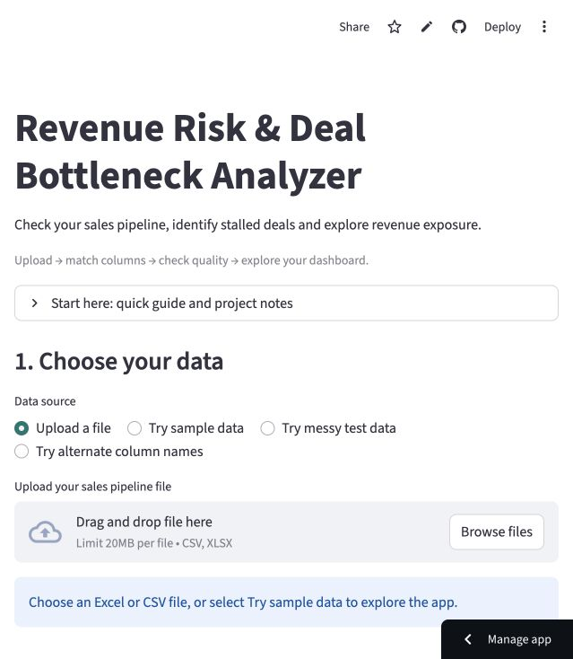
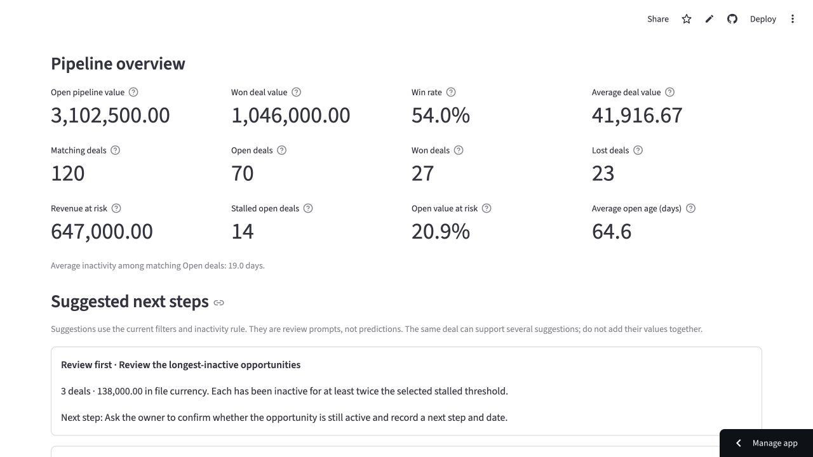
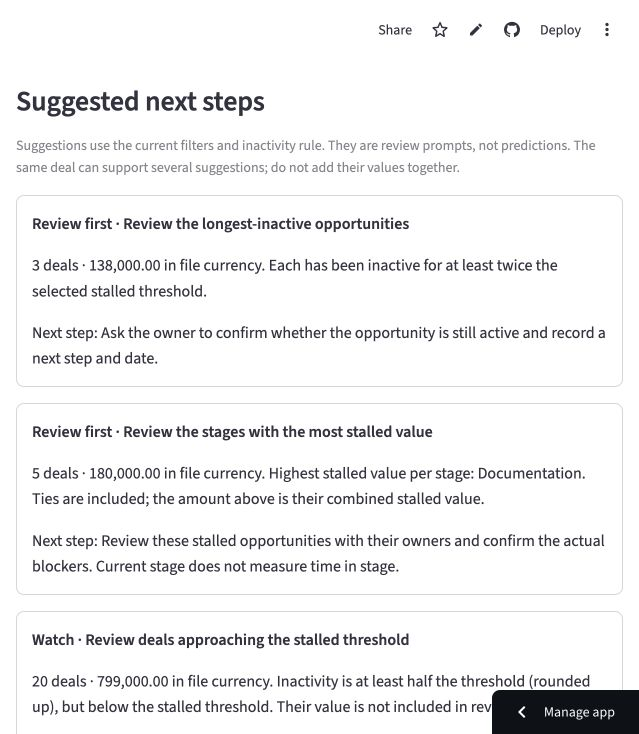
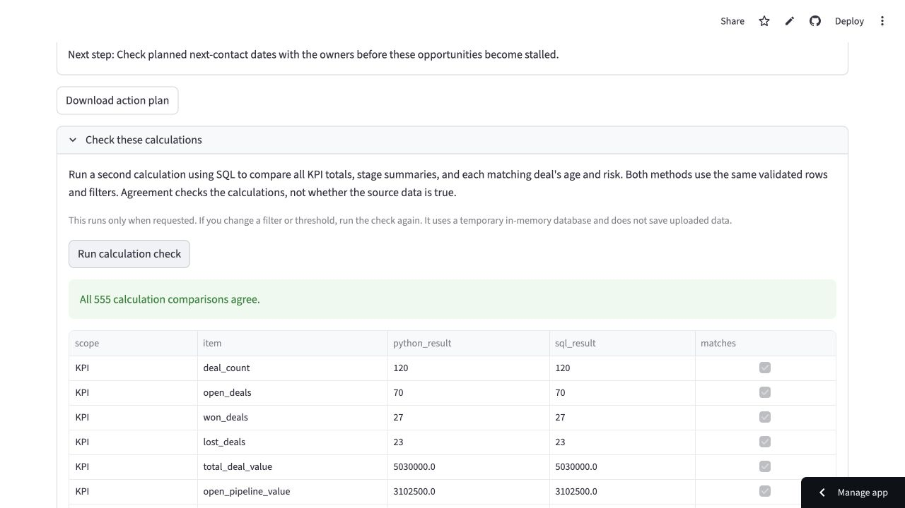

# Portfolio screenshot gallery

Captured from the deployed application on September 22, 2026. Analysis images use the original synthetic 120-deal workbook, September 22 as the analysis date, a 30-day threshold and all filters selected. The sample was tested both by actual Excel upload and built-in sample selection. Images show the browser widths used during verification, including a narrow layout and a wider desktop layout.

These images illustrate a portfolio demonstration; they are not results from a real company.

## Start and upload

## KPI overview

The sample has Open pipeline value 3,102,500 and exposed value 647,000 across 14 stalled Open deals. Win rate is 54%.

## Traceable suggestions

Suggested next steps show supporting counts, values and practical review actions. The same deal can appear in several cards.

## Risk categories

Low/Medium/High/Critical describe inactivity under the chosen rule, not a predictive probability of loss.

## Independent calculation check

The sample produces 555 matching comparisons across KPI outputs, stage summaries and deal-level assessments.

